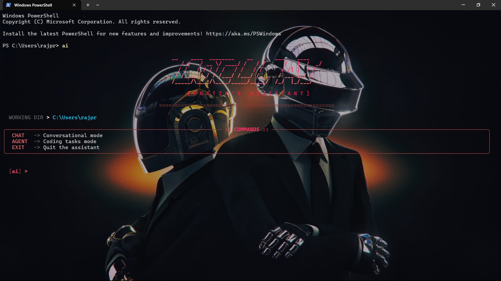

# AI CLI Tool

A local terminal-based AI coding assistant powered by **Ollama**.



## Features

- **Chat Mode** — Conversational AI with memory context
- **Agent Mode** — AI-powered code generation with planning & diff preview
- **Local & Private** — Runs entirely on your machine via Ollama

## Quick Start

```bash
# Install
pip install -e .

# Run
ai
```

## Commands

| Command | Description |
|---------|-------------|
| `chat` | Switch to conversation mode |
| `agent` | Switch to coding mode |
| `exit` | Quit |

## Requirements

- Python 3.10+
- [Ollama](https://ollama.ai) with `qwen2.5-coder:7b` model

```bash
ollama run qwen2.5-coder:7b
```

## License

MIT
